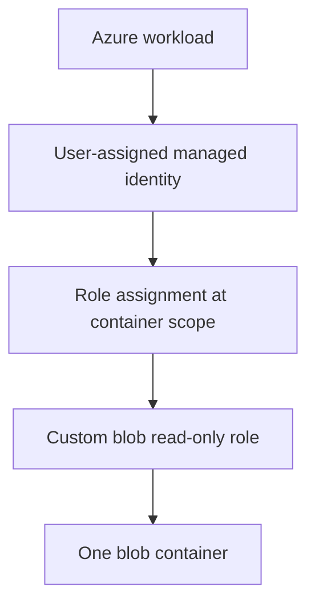

# terraform-azure-iam-baseline


> Small Terraform module that creates a user-assigned managed identity with least-privilege read-only access to one blob container.

For design rationale and limitations, see [docs/CASE_STUDY.md](docs/CASE_STUDY.md).

This repository is intentionally scoped to one reviewable Azure RBAC pattern: create a workload identity, define a custom role with only the permissions it needs, and assign that role at container scope. It does not claim to be a full Azure subscription baseline.

This is the Azure counterpart to [terraform-aws-iam-baseline](https://github.com/giselleevita/terraform-aws-iam-baseline), which demonstrates the same least-privilege argument on AWS IAM and S3.

---

## Reviewer Quick Start

For a fast technical review:

1. Inspect `main.tf` to verify that the role assignment scope is one container, not the storage account or resource group.
2. Inspect the `permissions` block to verify that no write, delete, or key-listing actions are granted.
3. Inspect `variables.tf` to see the module inputs and validation.
4. Run `terraform fmt -check`, `terraform validate`, and `tflint` through the existing CI workflow.
5. Read [docs/CASE_STUDY.md](docs/CASE_STUDY.md) for the design rationale and limitations.

---

## What It Creates



| Control | Implementation |
|---|---|
| Container-scoped access | The role assignment scope is the container resource ID, not the storage account |
| Custom role, not built-in | A purpose-built role definition replaces the broader built-in `Storage Blob Data Reader` |
| Data-plane read only | `data_actions` grants blob `read` alone; no `write`, `delete`, or `add` |
| No key access | `listKeys` is never granted, so the identity cannot fall back to shared-key auth |
| No secret in Terraform | A managed identity has no credential to store, rotate, or leak |
| Bounded assignability | `assignable_scopes` is the same single container, so the role cannot be reused more broadly |
| Input validation | Identity, role, resource group, storage account, and container names must be non-empty |

---

## What It Does Not Do

This module does not currently implement:

- Conditional Access policies
- Privileged Identity Management (PIM) or just-in-time elevation
- Azure Policy or management-group governance
- Key Vault access or secret management
- storage account network rules, private endpoints, or firewall configuration
- diagnostic settings, activity log export, or Defender for Cloud onboarding
- human-user or group lifecycle management

Those controls matter in a real subscription baseline, but they are outside this module's current implementation.

---

## Usage

```hcl
module "evidence_reader" {
  source = "./"

  identity_name        = "audit-evidence-reader"
  role_name            = "Audit Evidence Blob Reader"
  resource_group_name  = "rg-audit-evidence"
  location             = "westeurope"
  storage_account_name = "stauditevidence"
  container_name       = "evidence"

  tags = {
    Environment = "dev"
    Owner       = "security"
  }
}
```

The storage account and container are expected to exist already and to be managed separately.

---

## Requirements

- Terraform >= 1.5
- AzureRM provider >= 3.0
- Permissions to create user-assigned identities, role definitions, and role assignments (for example `Owner` or `User Access Administrator` on the target scope)

---

## Outputs

| Output | Description |
|---|---|
| `identity_principal_id` | Principal (object) ID of the managed identity |
| `identity_client_id` | Client ID used when the workload requests a token |
| `role_definition_id` | Resource ID of the custom read-only role definition |
| `assignment_scope` | Container scope the assignment is bound to |

---

## Next Improvements

To turn this into a true Azure identity baseline, add:

- Terraform tests that assert the exact granted actions and data actions
- an example workload (Container App or Function) consuming the identity
- an optional Key Vault secret-read role scoped to a single secret
- storage account network rules and a private endpoint example
- Conditional Access and PIM guidance for human identities
- provider configuration moved to the root module

---

## License

MIT
